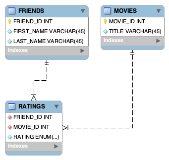

```{r setup, include=FALSE}
knitr::opts_chunk$set(echo = TRUE)
```

```{r}
library(RMariaDB)
library(dplyr)
```

## Database connection
Connect to the MySql database using the **MariaDB** driver. For security reasons, connection details are stored in a **CNF** file in a directory that is accessible by R. e.g., the current working directory.

```{r database-connect-function}
rmariadb.settingsfile <- 'assignment_sql_and_r.cnf'
rmarisdb.db <- 'movie_ratings'
my.dbConnect <- function() {
    db <- dbConnect(RMariaDB::MariaDB(), default.file=rmariadb.settingsfile,group=rmarisdb.db)
    db
}
```

Connect to the database:

```{r database-connect}
db <- my.dbConnect()
```

For sanity check, list the tables:

```{r list-tables}
dbListTables(db)
```

## Database schema
The schema is is normalized into 3 tables: FRIENDS, MOVIES, and RATINGS. This design allows all 3 schemas to evolve independently. For example, adding additional details to FRIENDS, like date of birth and address, can be done without impact the other schemas. Similarly, details can be added to MOVIES, e.g. director and release date.

Furthermore, for referential integrity, **foreign keys** have been added to RATINGS table. ER diagram for this schema is shown below:



Load the FRIENDS table:
```{r load-friends}
qry <- 'SELECT * FROM FRIENDS ORDER BY FIRST_NAME, LAST_NAME'
rs <- dbSendQuery(db, qry)
friends <- dbFetch(rs, n=-1)
dbClearResult(rs)
head(friends)
```

Load the MOVIES table:

```{r load-movies}
qry <- 'SELECT * FROM MOVIES ORDER BY TITLE'
rs <- dbSendQuery(db, qry)
movies <- dbFetch(rs, n=-1)
dbClearResult(rs)
head(movies)
```
Finally, load the movie ratings. Since the database schema is normalized, join the FRIENDS, MOVIES, and RATINGS tables to load rating. Ignore 'missing' ratings - the RATINGS.RATING column is an enumeration [0, 1, 2, 3, 4, 5] where 0 (default) denotes unrated movies.


```{r load-ratings}
qry <- 'SELECT f.FIRST_NAME, f.LAST_NAME, m.TITLE, r.RATING 
            FROM FRIENDS f, MOVIES m, RATINGS r 
            WHERE r.FRIEND_ID = f.FRIEND_ID AND r.MOVIE_ID = m.MOVIE_ID
            ORDER BY f.FIRST_NAME, f.LAST_NAME, m.TITLE'
rs <- dbSendQuery(db, qry)
ratings <- dbFetch(rs, n=-1)
dbClearResult(rs)
summary(ratings)
head(ratings)
```


Enumerations in MySQL as stored as characters. This is not the most convenient representation in R as we may want to do numeric analysis on ratings, e.g. average movie rating. Convert rating from character to integer:

```{r convert-rating-to-int}
ratings <- ratings %>% mutate(RATING = as.integer(RATING))
summary(ratings)
head(ratings)
```

A rating of 0 is assigned to unrated movies. Filter out data for unrated movies:

```{r}
ratings <- ratings %>% filter(RATING != 0)
summary(ratings)
head(ratings)
```

Close (disconnect) database connection:

```{r database-disconnect}
dbDisconnect(db)
```


